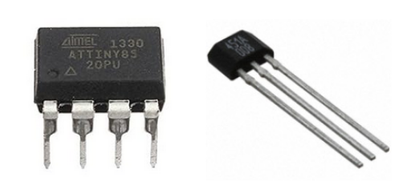
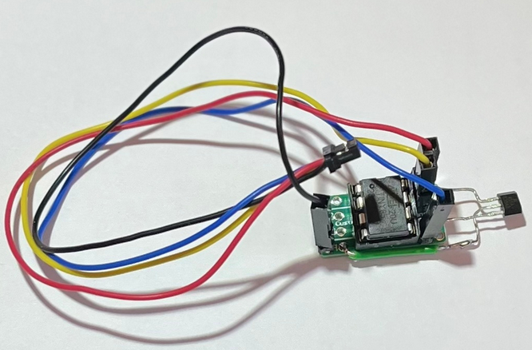

**ATtiny85 I2C Wind Speed Sensor**

This replaces an interrupt driven anemometer with a i2c device that counts pulses between readings. It could also be used to replace a interupt based rain gauge tipping bucket.

Perplexity claims the ATtiny85 micro controller will have little chance of phase/timing interrupt issues with theATtiny micro controller.




The ATtiny85 can be programmed to detect pin-change interrupts to count pulses from sensor SS451A. The SS451A output is clean and debounced due to its internal Schmitt trigger, so no hardware debounce should be needed. Also the ATtiny85 can provide the counted pulses since last read via i2c.

The i2c interrupt call asking for the count from the ATtiny85 will not impact wind speed readings.  If we miss them, it does not matter. The i2c call will return what has already been counted. Then the counter is set back to zero. To start over counting for the next period of time.

Original Atmel Dip-8 ATTINY85-20PU Tiny85-20Pu Ic Chip Pack Of 5Pcs  
[https://www.amazon.com/dp/B06W9JBJJ6](https://www.amazon.com/dp/B06W9JBJJ6)

Tiny AVR Programmer for Arduino  
[https://www.amazon.com/dp/B0BK9S6BXN](https://www.amazon.com/dp/B0BK9S6BXN)

SS451A datasheet  
[https://www.digikey.com/en/products/detail/honeywell-sensing-and-productivity-solutions/SS451A/2505488](https://www.digikey.com/en/products/detail/honeywell-sensing-and-productivity-solutions/SS451A/2505488)

Example  


Pinout  
Pin   Desc          To  
1     RESET         Not in use  
2     \[3\] A3        Not in use  
3     \[4\] A2        Not in use  
4     GND           I2C GND & SS451A GND       Pin 2 (Center Pin)  
5     \[0\] PWM       I2C SDA  
6     \[1\] PWM       SS451A Interrupt Pin 3 (Right)  
7     \[2\] A1        I2C SCL  
8      VCC          I2C VCC & SS451A VCC       Pin 1 (Left)

ATTINY85 Anemometer Code
```
/*
 *======================================================================================================================
 * WindSpeedAtTiny85 - 
 *   Board Type : Atmel Dip-8 ATTINY85-20PU https://www.amazon.com/dp/B06W9JBJJ6 
 *   Programmer : Tiny AVR Programmer for Arduino https://www.amazon.com/dp/B0BK9S6BXN
 *   Arduino Settings
 *      Programmer: USBtinyISP (ATTinyCore), SLOW, for new or 1Hz parts
 *      Board: AtTTinyCore -> ATtiny25/45/85 (No bootloader)
 *   Description: ATtiny85 Anemometer Rotation Counter. 
 *                Maintains count of interrupts from SS451A
 *                When this counter's 2 bytes are read via I2C, the count is reset
 *   Author: Robert Bubon
 *   Date:   2025-10-18 RJB Initial
 *======================================================================================================================
 */


#include <TinyWireS.h>

// Code for the ATtiny85 Anemometer Rotation Counter

// ATtiny Pinout
// Pin Desc    To
// 1   RESET   Not in use
// 2   [3] A3  Not in use
// 3   [4] A2  Not in use
// 4   GND     I2C GND & SS451A GND       Pin 2 (Center Pin)
// 5   [0] PWM I2C SDA
// 6   [1] PWM           SS451A Interrupt Pin 3 (Right)
// 7   [2] A1  I2C SCL
// 8   VCC     I2C VCC & SS451A VCC       Pin 1 (Left)


#define I2C_SLAVE_ADDRESS 0x8   // Address of the slave
#define INTERRUPT_PIN PB1       // Physical pin 6, Port B bit 1, Aka 1

volatile uint16_t pulseCount = 0;
volatile bool updated = false;

ISR(PCINT0_vect) {
  static uint32_t last_interrupt_time = 0;
  uint32_t current_time = micros();

  // The PINB register holds the current logical state (HIGH or LOW) of the physical
  // pins on Port B of the microcontroller at the moment you read it/
  //    Faster than "if (digitalRead(INTERRUPT_PIN) == LOW)"

  // Check if pin PB1 is LOW (falling edge)
  if ((PINB & (1 << INTERRUPT_PIN)) == 0) {  
    // Debounce: check if 2 ms has passed since last interrupt
    if (current_time - last_interrupt_time > 2000) {
      pulseCount++;
      updated = true;
      last_interrupt_time = current_time;
    }
  }
}

void requestEvent() {
  // Send 2 bytes (high byte first)
  TinyWireS.send((pulseCount >> 8) & 0xFF);
  TinyWireS.send(pulseCount & 0xFF);
  pulseCount = 0;  // reset count after reading
  updated = false;
}

void setup() {
  pinMode(INTERRUPT_PIN, INPUT_PULLUP);
 
  // Attach pin change interrupt for pulse counting
  GIMSK |= (1 << PCIE);      // Enable pin change interrupts globally
  PCMSK |= (1 << PCINT1);    // Enable PCINT1 interrupt for PB1 (pin 6)

  TinyWireS.begin(I2C_SLAVE_ADDRESS);
  TinyWireS.onRequest(requestEvent);

  sei(); // enable global interrupts
}

void loop() {
  TinyWireS_stop_check();  // Required to handle I2C slave requests
}
```

Example Code: ReadWindSpeed
```
/*
 *======================================================================================================================
 * ReadWindSpeedFeather - 
 *   Board Type : Adafruit Feather M0
 *   Description: Read ATtiny85 Anemometer Rotation Count 
 *   Author: Robert Bubon
 *   Date:   2025-10-18 RJB Initial
 *======================================================================================================================
 */

#include <Wire.h>

#define ANEMO_ADDR 0x08     // Same address as defined in TinyWireS.begin()

/* 
 *=======================================================================================================================
 * I2C_Device_Exist - does i2c device exist at address
 * 
 *  The i2c_scanner uses the return value of the Write.endTransmission to see 
 *  if a device did acknowledge to the address.
 *=======================================================================================================================
 */
bool I2C_Device_Exist(byte address) {
  byte error;

  Wire.begin();                     // Connect to I2C as Master (no addess is passed to signal being a slave)

  Wire.beginTransmission(address);  // Begin a transmission to the I2C slave device with the given address. 
                                    // Subsequently, queue bytes for transmission with the write() function 
                                    // and transmit them by calling endTransmission(). 

  error = Wire.endTransmission();   // Ends a transmission to a slave device that was begun by beginTransmission() 
                                    // and transmits the bytes that were queued by write()
                                    // By default, endTransmission() sends a stop message after transmission, 
                                    // releasing the I2C bus.

  // endTransmission() returns a byte, which indicates the status of the transmission
  //  0:success
  //  1:data too long to fit in transmit buffer
  //  2:received NACK on transmit of address
  //  3:received NACK on transmit of data
  //  4:other error 

  // Partice Library Return values
  // SEE https://docs.particle.io/cards/firmware/wire-i2c/endtransmission/
  // 0: success
  // 1: busy timeout upon entering endTransmission()
  // 2: START bit generation timeout
  // 3: end of address transmission timeout
  // 4: data byte transfer timeout
  // 5: data byte transfer succeeded, busy timeout immediately after
  // 6: timeout waiting for peripheral to clear stop bit

  if (error == 0) {
    return (true);
  }
  else {
    // sprintf (msgbuf, "I2CERR: %d", error);
    // Output (msgbuf);
    return (false);
  }
}


void setup() {

  int countdown=30; // Wait N seconds for serial connection, then move on.
  Serial.begin(9600);
  while (!Serial && countdown) {
      countdown--;
      delay (1000);
  }
  Serial.println("ATtiny85 Anemometer Reader Start");    
  Wire.begin();             // Join I2C bus as master

  if (I2C_Device_Exist(ANEMO_ADDR)) {
    Serial.println("ATtiny85 Anemometer Reader Initialized");
  }
  
}

void loop() {
  // Request 2 bytes from the slave device
  Wire.requestFrom(ANEMO_ADDR, (uint8_t)2);

  if (Wire.available() >= 2) {
    uint8_t highByte = Wire.read();   // First byte = high byte
    uint8_t lowByte  = Wire.read();   // Second byte = low byte

    // Combine into 16-bit integer
    uint16_t pulseCount = ((uint16_t)highByte << 8) | lowByte;

    // Print value
    Serial.print("Pulse count: ");
    Serial.println(pulseCount);
  } else {
    Serial.println("No data received from ATtiny85!");
  }

  delay(1000);  // 1 second between readings
}
```